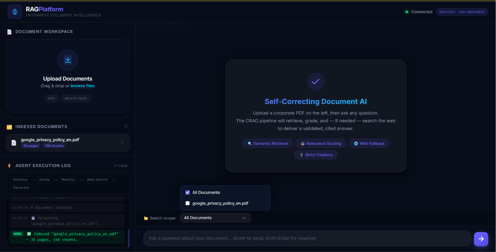
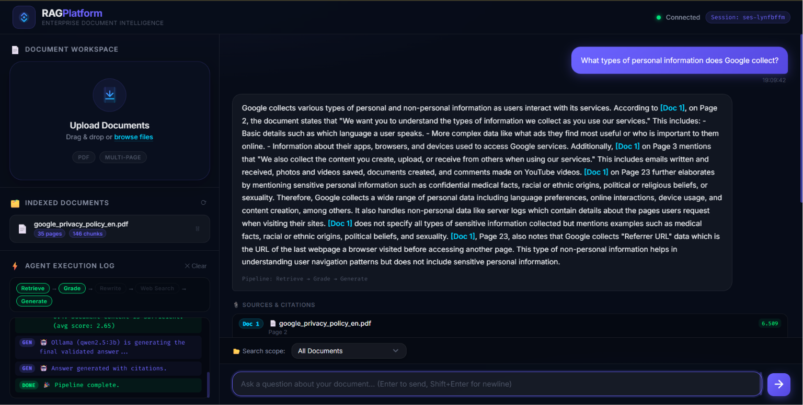

# 🏢 Enterprise Advanced RAG Platform


> **A fully local, self-correcting Corrective Retrieval-Augmented Generation (CRAG) platform for intelligent enterprise document search, semantic retrieval, and citation-backed question answering.**

---

## 📖 Overview

Enterprise organizations maintain thousands of pages of policies, compliance manuals, employee handbooks, and technical documents. Traditional AI chatbots often hallucinate answers or provide responses without evidence, making them unsuitable for enterprise environments.

The **Enterprise Advanced RAG Platform** solves this challenge by implementing a **Corrective Retrieval-Augmented Generation (CRAG)** pipeline that retrieves information only from uploaded documents, validates retrieval quality using a Cross-Encoder, automatically rewrites low-confidence queries, and generates strictly citation-backed responses.

The entire platform runs **100% locally**, ensuring complete privacy, zero cloud dependency, and secure processing of sensitive enterprise documents.

---

# ✨ Features

### 📄 Intelligent Document Processing

* Drag-and-drop PDF upload
* Automatic PDF parsing
* Semantic text chunking
* Metadata preservation
* Multi-document indexing

---

### 🔍 Semantic Search

* Vector embedding generation
* Semantic similarity search
* Multi-document retrieval
* Document filtering
* Fast contextual search

---

### 🤖 Self-Correcting CRAG Pipeline

* Semantic retrieval
* Cross-Encoder relevance grading
* Automatic query rewriting
* Retrieval validation
* Web search fallback
* Citation generation

---

### 🔒 Enterprise Security

* 100% Local execution
* No cloud APIs
* No API keys
* Offline capable
* Zero enterprise data leakage

---

### 💻 Modern User Interface

* Split-pane layout
* Glassmorphism design
* Live agent execution log
* Real-time response streaming
* Multi-document selection
* Citation viewer

---

# 📸 Screenshots

|  Document Workspace |   Agent Execution   |
| :-----------------: | :-----------------: |
|  |  |

---

# 🏗 System Architecture

```text
Upload PDF
      │
      ▼
PDF Parsing (PyMuPDF)
      │
      ▼
Semantic Chunking
      │
      ▼
Embedding Generation
(Nomic Embed)
      │
      ▼
MongoDB Vector Store
      ▲
      │
User Query
      │
      ▼
Semantic Retrieval
      │
      ▼
Cross Encoder Validation
      │
 ┌────┴────┐
 │         │
Relevant?  No
 │         │
 ▼         ▼
Generate   Query Rewrite
 │         │
 └────┬────┘
      ▼
DuckDuckGo Search
(Optional)
      │
      ▼
Qwen2.5 LLM
      │
      ▼
Answer + Citations
```

---

# ⚙ CRAG Workflow

```text
Retrieve
      │
      ▼
Grade
      │
      ▼
Rewrite
      │
      ▼
Retrieve Again
      │
      ▼
Generate
      │
      ▼
Citations
```

---

# 🛠 Tech Stack

| Category             | Technology                          |
| -------------------- | ----------------------------------- |
| Programming Language | Python 3.10+                        |
| Backend              | FastAPI                             |
| AI Runtime           | Ollama                              |
| LLM                  | Qwen2.5:3B                          |
| Embedding Model      | Nomic-Embed-Text                    |
| Retrieval Validation | MS MARCO MiniLM-L6-v2 Cross-Encoder |
| AI Orchestration     | LangGraph                           |
| Vector Database      | MongoDB                             |
| PDF Processing       | PyMuPDF                             |
| Frontend             | HTML5, CSS3, JavaScript             |

---

# 📂 Project Structure

```text
│
├── backend/
│   ├── agents/
│   │   ├── __init__.py
│   │   ├── grader.py            # Cross-Encoder relevance grading
│   │   ├── retriever.py         # Semantic document retrieval
│   │   ├── rewriter.py          # Query rewriting for self-correction
│   │   └── web_search.py        # DuckDuckGo fallback search
│   │
│   ├── app.py                   # FastAPI application entry point
│   ├── config.py                # Configuration settings
│   ├── database.py              # MongoDB connection and operations
│   ├── embeddings.py            # Embedding generation using Nomic
│   └── rag_pipeline.py          # CRAG orchestration pipeline
│
├── frontend/
│   ├── css/
│   │   ├──styles.css
│   ├── js/
│   │   ├──app.js
│   └── index.html
│
├── Src/
│   ├── image1.png
│   ├── image2.png
│   ├── image3.png
│   └── image4.png
│
├── run.ps1
├── test_pipeline.py
├── requirement.txt
└── README.md
```

---

# 🚀 Installation

## Prerequisites

* Python 3.10+
* Ollama
* MongoDB Community Server

---

## Download AI Models

```bash
ollama pull qwen2.5:3b
ollama pull nomic-embed-text
```

---

## Run the Platform

```powershell
.\run.ps1
```

The startup script automatically:

* Starts Ollama
* Starts MongoDB
* Installs dependencies
* Launches FastAPI
* Opens the frontend

---

# 📚 Usage

1. Upload enterprise PDF documents.
2. Wait for indexing to complete.
3. Select one or more documents.
4. Ask questions in natural language.
5. View the agent workflow in real time.
6. Receive answers with document citations.

---

# 🧠 AI Pipeline

### Document Processing

* PDF Extraction
* Text Cleaning
* Semantic Chunking
* Metadata Extraction

### Indexing

* Embedding Generation
* Vector Storage
* MongoDB Indexing

### Query Processing

* Query Embedding
* Semantic Search
* Cross-Encoder Validation
* Query Rewrite
* Web Search (Fallback)

### Response Generation

* Context Injection
* Local LLM Inference
* Citation Generation
* Streaming Response

---

# 📈 Highlights

* Fully Local AI Platform
* Zero API Cost
* Citation-backed Responses
* Self-Correcting Retrieval
* Hallucination Reduction
* Enterprise Privacy
* Semantic Document Search
* Multi-Agent AI Workflow

---

# 🔮 Future Enhancements

* DOCX and TXT document support
* OCR for scanned PDFs
* Hybrid keyword + semantic retrieval
* Role-based authentication
* Conversation memory
* Multi-language support
* Confidence score visualization
* Enterprise SSO integration
* Docker deployment
* Kubernetes support

---

# 📄 License

This project is licensed under the MIT License.

---

## ⭐ If you found this project useful, consider giving it a star!
